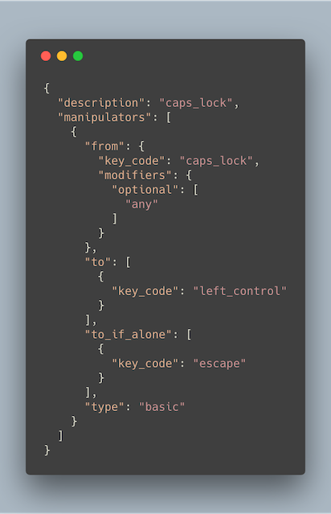
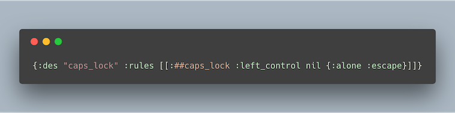
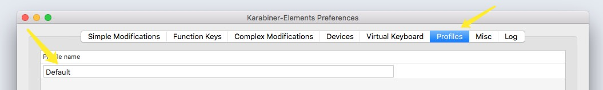

# GokuRakuJoudo


[Examples](./examples.org) &mdash;
[Tutorial](./tutorial.md) &mdash;
[Telegram](https://t.me/joinchat/UDlL5H7VIwAVK0_7) &mdash;
[Goku in the wild](./in-the-wild.md)

1.  [Intro](#intro)
    1.  [Why use Goku?](#why)
    2.  [Install](#install)
    3.  [Usage](#usage)
    4.  [Tutorial](#tutorial)
    5.  [Note](#note)
    6.  [Changelog](#changelog)
    7.  [Dependencies](#dependencies)
    8.  [Contributing](#contributing)


<a id="GokuRakuJoudo"></a>

# Intro

Goku is a tool that lets you manage your
[Karabiner](https://github.com/tekezo/Karabiner-Elements) configuration with
ease. 

Karabiner Elements uses JSON as its config file format. This leads to thousands of lines
of JSON (sometimes over 20,000 lines), which makes it really hard to edit the
config file and iterate on your keymap.

But fear not! Goku brings the [edn format](https://github.com/edn-format/edn) to the rescue.


<a id="why"></a>

## Why use Goku?

Below are two Karabiner configuration snippets that map caps lock to an escape
key.  

<div class="HTML">
<p align="center"></p>
<p align="center">karabiner.json</span>
</div>

<div class="HTML">
<p align="center"></p>
<p align="center">karabiner.edn</span>
</div>

In practice this means that you can see multiple Karabiner rules on you screen
as you edit your config with Goku. Which speeds up the iteration speed
significantly as you can create new rules as little as few characters.  


<a id="install"></a>

## Install

    brew install yqrashawn/goku/goku


<a id="usage"></a>

## Usage

Make sure you have a profile named "Default" in Karabiner's GUI tool. You can
specify your own profile name [using `:profiles`
keyword](https://github.com/yqrashawn/GokuRakuJoudo/blob/master/examples.org#profiles). 



Goku reads the `karabiner.edn` file which holds your Karabiner config. This file
should be placed inside `~/.config/` directory on your Mac (you can start with
[example.edn](./resources/configurations/edn/example.edn "example.edn")).
Starting from version 0.2.2, you can specify your config file path using the
environment variable `GOKU_EDN_CONFIG_FILE`.   

Goku provides two commands:

`goku`: Will update karabiner.json once.
`gokuw`: Will keep watching your `karabiner.edn` and when it changes, it will update your
`karabiner.json` configuration. 

Run command `brew services start goku` to use it as a service (runs `gokuw` in
background). When Goku is running as service, the logs are kept inside
`~/Library/Logs/goku.log`.  

Use `goku -h` to learn more.


<a id="tutorial"></a>

## Tutorial

Read through the [Tutorial about how you can write the configuration in
Goku](./tutorial.md). 

If there's any question or advice, just [open an issue](../../issues/new) or
join [Karabiner Telegram group](https://t.me/joinchat/UDlL5H7VIwAVK0_7) and ask your
questions there. 

<a id="note"></a>

## Note

- From/to key definitions can contain key symbols like ‹⇧ instead of !S for a left shift, more details at [List of supported key symbols](./KeySymbols.md)
-  ~~Using `#_` to comment out rules [like
   this](https://github.com/yqrashawn/yqdotfiles/blob/2699f833f9431ca197d50f6905c825712f7aee8d/.config/karabiner.edn#L41)
   will leave a null rule (see below) in karabiner.json, it won't cause any
   error.~~ 

```json
    {
      "description" : null,
      "manipulators" : [ ]
    }
```

<a id="changelog"></a>

## Changelog

Check [CHANGELOG](./CHANGELOG.org) file.

<a id="dependencies"></a>

## Dependencies

[watchexec](https://github.com/watchexec/watchexec) for watching the edn config
file.   
[joker](https://github.com/candid82/joker) for linting the edn config file.   

<a id="contributing"></a>

## Contributing

Use `lein repl` for developing.

`make compile` to compile clojure file to jar
`make bin` to compile jar to native file (make sure GRAALVM `native-image` binary is in `PATH`)
